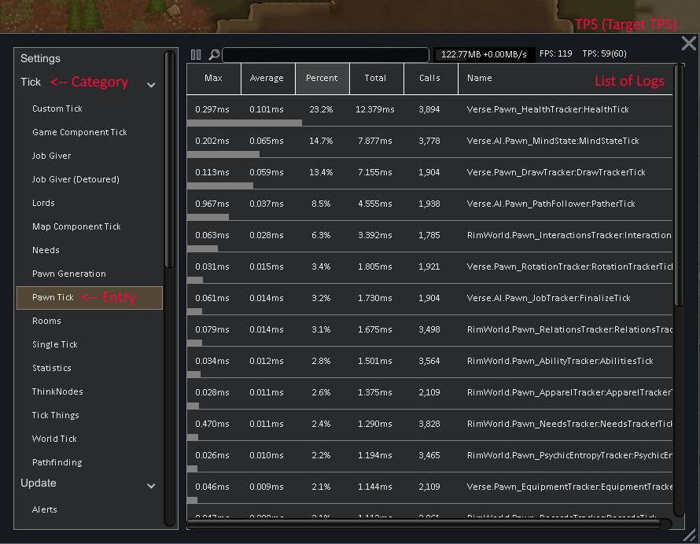
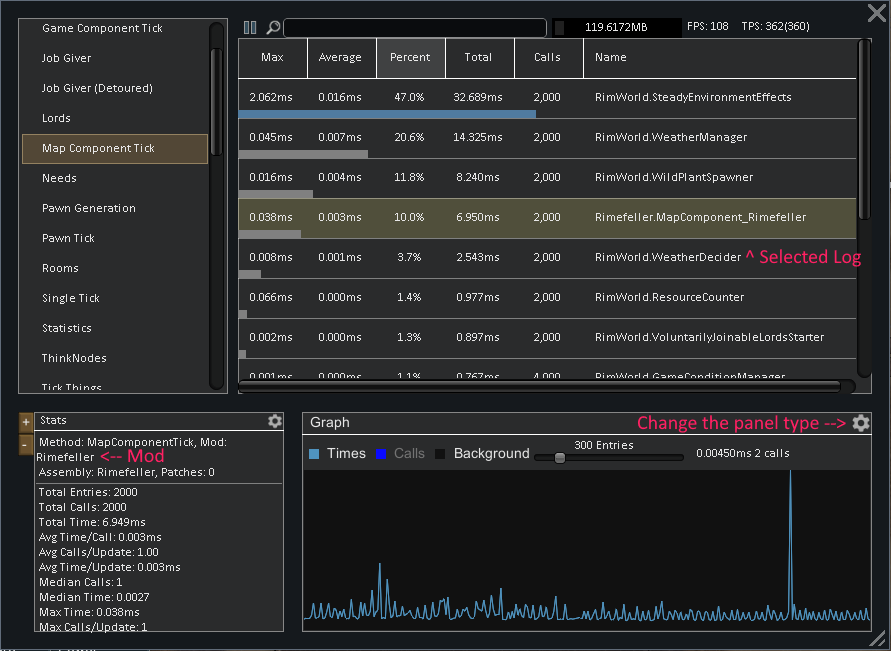
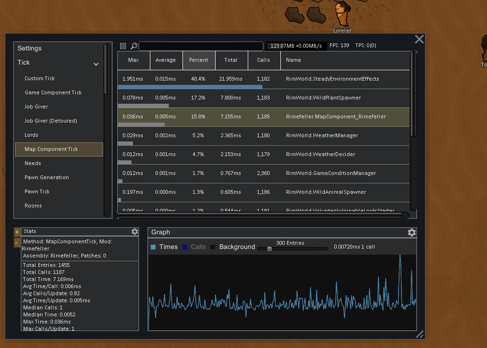
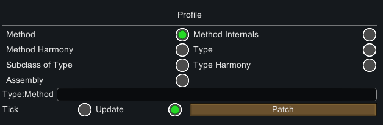

# Basic Understanding

## Lingo


## Some Simple Statistics
Rimworld's update cycle is broken up into units called *ticks*. Ticks measure the speed at which things change within the game. When you adjust the game speed in the bottom right, you increase the amount of ticks the game tries to execute per second. At 1x, it tries to reach 60 *ticks per second* (tps); at 2x, 180tps; at 3x, 360tps; and the dev mode 4x (also accessible through the Smart Speed mod), 900tps. These numbers are doubled whenever all player-controlled pawns on a map are sleeping.

Time for a little math. We can see that to reach 60fps, we need each rendered frame to take less than  per *update* to reach 60fps. This means to reach 60fps at 3x speed, each tick needs to be *on average* below . Any spikes in tick length will likely cause FPS to drop, though if the spikes are irregular, it may not significantly slow down gameplay.

The game will always try to run at 60 updates per second. However, ticks are actually independent to updates; in other words, multiple ticks can be occur within a single frame. This is the true difference between the Tick category and the other categories. The entries which are shown in the Tick category can update more or less frequently, depending on your game speed. Keep in mind that if each tick takes too long, the game will automatically throttle your TPS to stabilize your FPS.

When attempting to interpret the data provided by the Analyzer, it is important to recognize which Category a given readout is coming from. An average of ~2ms in the Tick category, when adjusted for higher speeds, is worse than an average of ~3ms in any other category. 


## Reading the Display
If your issue is that your FPS is inconsistent but your TPS is relatively stable, you should be focusing on the **max** value for logs. This is because large spikes in TPS can affect your FPS without consistently slowing down your game.

If your issue is that both FPS and TPS are consistently low, you should be focusing on the **average** value for the logs. 

When looking at logs in the Row format, the coloured bar indicates the percentage makeup of the log's average in the current entry. When an entry is over 75% of the category it will be coloured red, when less than 75% but higher than 25%, it will be blue. If it is less than 25% or is precisely 100% of the entry, it will be shown as grey.

The graph which pops up when selecting a log displays the a realtime view of the collective time the method is taking for a given update period. If you are in an entry in the Tick category, this update period will be one tick, otherwise it will just be a frame. The graph is useful for discerning patterns in the information, which the average/max will be able to display.

## Finding a Mod a method is from
Finding slow logs (and the associated method) is all well and good, and useful for modders, but for a user it is not something which helps. When you select a log, a panel will pop-up which contains information about which mod the method comes from, the dll, and some extra statistics.



This will (if possible) show you the mod, and the assembly that the method is attributed to. This will not always work, mods often (annoyingly) package dependent dll's in their mods, so they don't have to have an explicit dependency on another mod. This will not get picked up, and ***can*** mis-attribute the 'source' of the lag. 

---
# Basic Troubleshooting

## Common Offenders

#### TickList.Tick
This is the overaching method which calls all 'Tick' methods in the game. Inside this method, is all work which executes on tick, to find where this time is being spent, its recommended to look in the 'Pawn Tick' or 'Tick Things' category. Both of which offer a more fine grain look into *what* is ticking and taking large amounts of time. It is similar to Frame Time in this regard.

#### Pawn.Tick

Pawn Tick is the 'tick' method for Pawns, it is responsible for all updates specific to the pawn. For example, pawns finding jobs, pathfinding etc. The individual methods which are called within Pawn:Tick are profiled in the entry 'Pawn Tick'. You can also right click the log, and press 'Profile the Internal Methods of', which will show you the methods which are called within Pawn:Tick

#### ThinkNodes (Priority, Subtree, etc)

ThinkNodes are the AI behind the pawn, they control the decisions a Pawn makes. They are relatively high level, thus, when viewing times from them, understand that a lot of methods from other categories are included in the times you view, For example, JobGivers are a 'type' of ThinkNode, and are directly called from ThinkNodes, as part of a Pawns reasoning process in choosing a job.

#### WorkGivers

WorkGivers are how pawns find jobs to do, a common example could be, looking through the entire map for some buildings which may offer a job. For example, re-arming turrets, filling brewing barrels etc. They are quite often implemented in mods, and are easy to get wrong - Sometimes there is the suffix 'Very Bad' on WorkGivers, if you see this, it means the WorkGiver is doing a broad search on all Artificial Buildings on the map.

## Error when Attempting to open the Analyzer Window
If you see the error *[Analyzer] Analyzer is currently in the process of cleaning up ...* and cannot open the window. Just wait a few seconds, this occurs because after you are finished using the Analyzer, it removes all of the profiling and hooks it has, in order to reduce the overhead it incurs on your game. This happens on a seperate thread, and does not effect gameplay at all, however depending on how many methods where profiled, the GC which is manually called after the cleanup can take a substantial amount of time. (This cleanup process does not effect the Performance patches at all).

---
# Advanced Usage

## Linking Analyzer to Dnspy
In the analyzer settings there is checkbox that, when enabled, will 'link' dnSpy to the Analyzer. This will allow you to directly open methods from inside the Analyzer from any loaded mod within dnSpy.

Provide the absolute path to (and including) the dnSpy.exe. This allows it to be accessed via command line from in game by the Analyzer.



## Internal Profiling
You can right-click the logs themselves to internal profile the method. This will show the methods which comprise the method you are profiling and the time it takes to execute them. This will open up a new entry named 'Method-int' which can be closed by right clicking on the entry itself.


## Custom Profiling
While using the Analyzer, there are a variety of ways by which methods can be profiled. These are displayed on the main dev page.

You can patch:
- Method (A method - non generic)
- Type (All the methods inside a type)
- Patches on a Method (All the Harmony Patches which effect a method)
- Patches on a Type (All the Harmony Patches which effect the methods of a type)
- Subtypes of a Type (All methods in the subtypes of a given type)
- Method Internals (Internal method profiling on a given method)
- Mod/Assembly (Patch all the methods implemented in an assembly)



## Stack Traces
You can view where a method is being called from by using the stack trace panel (accessible from the cog on the bottom panel windows). This will show you all the unique methods which are calling the method you are profiling, keep in mind that this will slow down your game significantly, mainly due to the retrieving of the stack trace itelf.

---
# For Modders

## Exceptions
When exceptions are thrown in a method that is being profiled, The timer will be completely ***incorrect***. This is because the Stopwatch's `Stop()` function will never be called. This could hypothetically be remedied by using a Finalizer (or a raw try-catch), but this will incur a large amount of overhead, likely slowing the game to a crawl in entries with large amounts of methods. 

There is the potential of in the future making a switch which would enable you to profile while including a try-catch for specific methods. However it is more work than it is worth currently, if it is a feature you would like, you are free to implement it yourself [here](Source/Profiling/Utility/ProfilingUtility/MethodTransplanting.cs#L102-L282)

## Using the Analyzer.xml
You can create a tab in the Analyzer specifically for your mod ahead of time by creating an XML file. This saves you the work of having to repatch the same methods to profile your mod during development. The file should be formatted as follows:
```xml
<Analyzer>
    <tabName>
        <Types>
            <li>Verse.Pawn</li>
        </Types>
        <Methods>
            <li>Verse.Thing:Tick</li>
        </Methods>
        <NestedTypes>
            <li>Verse.ThreadLocalDeepProfiler</li> 
        </NestedTypes>
    </tabName>
</Analyzer>
```
This will create a tab titled `tabName` which will profile all the methods in the type `Verse.Pawn` and the method `Verse.Thing:Tick`. It will also profile all methods implemented in the nested types of `Verse.ThreadLocalDeepProfiler`. Primary use-case for the nested classes being nested harmony-patch classes.

This file should be placed in the root directory of your mod. If you wish to avoid cluttering the Analyzer for end users, remember to remove it before releasing to steam. However, you might also decide to keep it in to allow users to easily see how your mod performs, to pre-emptively counter complaints.

## Predicted Overhead
The act of profiling obviously takes time. Let's look at how this *generally* works, noting that there are a few different techniques used to patch different methods, as sometimes it requires more fine grain control than what a generic transpiler can offer.

For a given method `Foo`
```csharp
public static void Foo(...)
{

    // ...

    if(cond) return trueCond;
    else return falseCond;
}
```

This translates to ~
```
// ...
007 brfalse.s cond (Label 3)
008 ldloc trueCond
009 ret
010 label 3
010 ldloc falseCond
011 ret 
```

Analyzer inserts a start setup inside the profiling method, I.e. Via transpiler, injects the code to find and setup state in your method, and then, for every point of exit in the method, will insert stack neutral code which attempts to stop the stopwatch (IA). 

This means, that there should be 0 noise between the starting and the stopping of a stopwatch. However, this does not account for inaccuracy within the `Stopwatch` class itself. In a similiar fashion, if the method throws execeptions, there is no guarantee your timings for it are at all correct.

The stack will, after the transpiler, look like
```
// Insert startup routine for Profiler
// Profiler.Start() // start stopwatch

// Start Foo's execution here

// ...

007 brfalse.s cond (Label 3)
008 ldloc trueCond

// End the profiler here if it has been started

009 ret
010 label 3
010 ldloc falseCond

// End the profiler here if it has been started

011 ret 
```

The implementation for this is [here](Source/Profiling/Utility/ProfilingUtility/MethodTransplanting.cs#L102-L282)

## Technical Explanations

### Tick Vs Update Methods
In Analyzer there are two different types of 'updates'. One is named `UpdateCycle`, and the other is named `FinishUpdateCycle`. The FinishUpdateCycle is called a varying amount of times per second. It is responsible for spawning the thread where the logic is performed for your logs. This can be performed up to 20 times per second. (This can be customized inside the settings for the mod).

`UpdateCycle`, however, is determined by the Category you are in. It is responsible for the difference in speed of the graph between viewing an entry from the Tick category and viewing an entry from the Update category. Any category aside from Tick updates when `Root_Play.Update` completes. This symbolizes one 'update' cycle within the game. Tick, however, is updated every time `TickManager.DoSingleTick` completes. This can happen multiple times per update, which accounts for the difference in update speed.

This change will also affect the total time and number of calls for a method over a given time period, as this can potentially be split depending on what speed the game is running at. You can profile anything as a Tick method vs an Update method.

### Method Switching (Transpiler and Internal Profiling)
In order for transpiler profiling and internal method profiling to work, there needs to be a process to 'profile' internal components of a method. This is done by parsing the IL, finding all instructions which are either `Call` or `CallVirt`, then measuring the time it takes for the methods called inside them to execute.

This process looks roughly like this:
```csharp
public static int MyTargetMethod(int param1, bool param2)
{
    // ...
    Foo(param1, local2);
    // ...
}

public static void Foo(int param2, int local2)
{
    // ...
}

```
After the method has been transformed: 
```csharp
public static int MyTargetMethod(int param1, bool param2)
{
    // ...
    Foo_runtimeReplacement(param1, local2);
    // ...
}

public static void Foo_runtimeReplacement(int param2, int local2)
{
    Stopwatch.Start();
    Foo(param2, local2);
    Stopwatch.End();
    return; 
    /* 
    The value which is currently on the stack will be returned applicable 
    (Stopwatch.End() is stack neutral) - cannot be expressed very well in
    C# 
    */ 
}
```
The `Stopwatch.Start();` above is simplified because the process here is specific to how Analyzer collects data on methods, and thus is unimportant to the example.

The implementation of this is [here](Source/Profiling/Utility/ProfilingUtility/MethodTransplanting.cs#L292-L393)

### Transpiler Profiling
Transpiler profiling is done using a relatively simple approach. The IL of the original method is compared to the current IL (after all transpilers have been applied) and a diff algorithm is applied. This profiling hinges on the fact that the diff algorithm is correct (which it may not always be!), I'd greatly appreciate examples where the algorithm *incorrectly* attributes an 'Added' method when no such method was added. Or improvements to the diff algorithm itself [here](Source/Profiling/Utility/Myers.cs)

For each of the added IL instructions that are of the type `Call` or `CallVirt`, the method it calls is swapped out with a *profiling method* (as described above). 

The ***sum*** of these added calls is considered the 'added' weight by the transpiler(s). This can not handle methods which throw exceptions. The added weight of a try-catch bracket for each profiler is not worth it. (As explained prior).

This will also collate all transpilers on a given method, as there is only the IL after all the methods have been applied. Doing specialisation like, calculating the assembly an added method is implemented in is likely to be misleading, as one could insert a call to a vanilla method in a transpiler, which would lead the viewer to believe 'Core' transpiled its own method in.

This does not handle all cases. Mods which add branching, or exception blocks via transpilers will not be profiled, and would likely given misleading results if an attempt was made. Similarly, mods which just add / swap a single instruction, or add a `mul` or `sub` opcode are very unlikely to add any overhead, so it is not worth profiling (You would be more likely to see overhead from the stopwatch, than the actual effect of the instruction).

### Internal Method Profiling
Internal method profiling is done by iterating through the IL of a method. For each of the `Call` or `CallVirt` instructions, the operand method is swapped out as described above.

This swaps out the instruction, which means that instead of replacing the method, it will only profile the method when it is called from inside the original method you are internal profiling. Otherwise, your profiling will pick up every single call to the method.

## Edge Cases

### IEnumerable
If you are seeing spikes from relatively simple Postfixes which deal with IEnumerables, keep in mind how IEnumerables work. This section is only relevant when the IEnumerable is being frontloaded. If you are doing a Postfix where a parameter you are checking is an IEnumerable, and you are doing a call like `.Any()` or `.Select`, your Postfix will force the calculation for the IEnumerables. The time this takes will be attributed to your Postfix. Additionally, each IEnumerator generated from the IEnumerable will have to repeat the calculation. This is something you should attempt to avoid - even if it seems misleading at first.