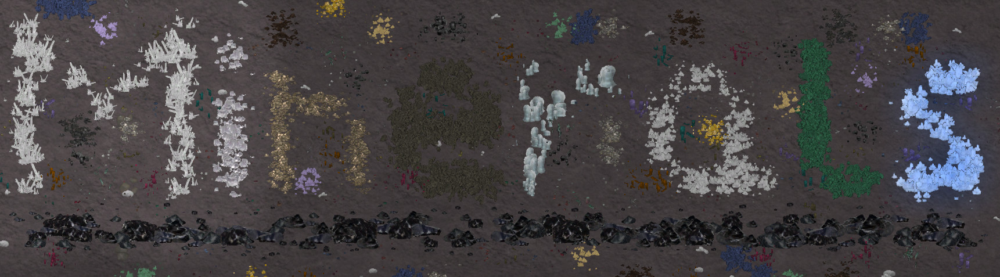

```{r setup, include=FALSE}
library(mineralsReadmePrinter)
knitr::opts_chunk$set(echo = FALSE)
```


## Minerals: A rimworld mod



This mod adds various mineral-related content and replaces the textures and mechanics of all rocks in the game.


## Dynamic minerals

These spawn, grow, and shrink depending on conditions.

```{r}
print_minerals("Defs/ThingsDefs_Minerals/DynamicMinerals.xml")
```

## Static minerals

These are randomly spawned when a map is created and are never respawned in a given map.

```{r}
print_minerals("Defs/ThingsDefs_Minerals/StaticMinerals.xml")
```

## Giant minerals

These are large versions of other minerals in this mod and have a chance to drop a special minified version of the mineral that can be installed like art.
They are very rare and valuable and only occur where their smaller versions are abundant.

## Rocks

The minerals mod enhances the aesthetic and practical aspects of rocks, including walls and passable obstacles like boulders.
Unlike the vanilla rock walls, these rocks might drop other resources like rubble, sand, gems, obsidian, and flint, depending on the type.
Each type of rock (limestone, granite, etc) has distinct advantages and disadvantages.
Below are how each type might affect gameplay, in order of hit points.

### Claystone

* Hit points / time to mine: **lowest**
* Chunk drop rate: very high
* Always drops: crushed rock
* Often drops: soft clay, flint (MineralsCraft mod)
* Landscape: complex with some cover
* Beauty: high

Claystone is a soft sedimentary rock, so is quite easy to work with and mine.
Unlike other rock type, mining claystone yields soft clay along with crushed rock.


### Sandstone

* Hit points / time to mine: very low
* Chunk drop rate: **highest**
* Always drops: crushed rock, sand
* Often drops: flint (MineralsCraft mod)
* Landscape: few rocks and little cover
* Beauty: **highest**

Sandstone is a soft sedimentary rock, so is quite easy to work with and mine.
Since sandstone erodes faster than other rocks, sandstone landscapes tend to be less rocky overall and provide less cover.
Unlike other rock type, mining sandstone yields sand along with crushed rock.

```{r}
# print_minerals("Defs/ThingDefs_Rocks/Sandstone.xml")
```

### Slate

* Hit points / time to mine: low
* Chunk drop rate: medium
* Always drops: crushed rock
* Often drops: slate blocks, flint (MineralsCraft mod)
* Landscape: not rocky and little cover
* Beauty: medium

Slate is a fine-grained metamorphic rock formed from compacted volcanic ash or silt.
It forms in regular layers that are rectangular enough to be used for buildings without stoneworking.

```{r}
# print_minerals("Defs/ThingDefs_Rocks/Slate.xml")
```

### Limestone

* Hit points / time to mine: medium
* Chunk drop rate: high
* Always drops: crushed rock
* Often drops: flint (MineralsCraft mod)
* Landscape: somewhat rocky and some cover
* Beauty: low

Limestone is a hard sedimentary rock.
Its uniformity and medium hardness makes limestone a good building material.

```{r}
# print_minerals("Defs/ThingDefs_Rocks/Limestone.xml")
```

### Marble

* Hit points / time to mine: high
* Chunk drop rate: medium
* Always drops: crushed rock
* Often drops: Rough gems
* Landscape: somewhat rocky and lots of cover
* Beauty: high

Marble is a metamorphic rock of melted and recrystallized limestone.
It is often used in decorative applications but is also quite hard.

```{r}
# print_minerals("Defs/ThingDefs_Rocks/Marble.xml")
```

### Basalt

* Hit points / time to mine: high
* Chunk drop rate: medium
* Always drops: crushed rock
* Often drops: obsidian (MineralsCraft mod)
* Rarely drops: Rough gems
* Landscape: very rocky and some cover
* Beauty: **lowest**

Basalt is the most common igneous rock and is often associated with recent volcanic activity.
Recent lava flows can make basalt landscapes variable, very rocky, and difficult to build on.

```{r}
# print_minerals("Defs/ThingDefs_Rocks/Basalt.xml")
```

### Granite

* Hit points / time to mine: **highest**
* Chunk drop rate: **lowest**
* Always drops: crushed rock
* Often drops: Rough gems
* Landscape: somewhat rocky and lots of cover
* Beauty: medium

Granite is an igneous rock which cooled slowly deep underground, allowing for large crystals to form.
It is very strong, but difficult to quarry.

```{r}
# print_minerals("Defs/ThingDefs_Rocks/Granite.xml")
```

### Rock types

There are five general sizes of rocks, which vary in how they restrict movement, provide cover, and yeild resources.
Below each type is described, going from largest to smallest


#### Hewn rock walls

These replace the vanilla rock walls that are under thick natural roofs and not adjacent to passable terrain.
They are typically only seen when mining.
These yeild the most resources in general and have the most hit points.

#### Solid rock walls

These replace the vanilla rock walls that are under thin natural roofs or under thick mountain roofs when adjacent to passable terrain.
These yeild slightly less resources than hewn rock walls and have slightly fewer hitpoints.  

#### Weathered rock walls

These replace the vanilla rock walls that are unroofed when the map spawns.
They yeild less resources than hewn or solid rock walls and have fewer hitpoints.  

#### Boulders

Large rocks that can be climbed over, but cannot be stood on.
They provide very good cover in gunfights.
They are the most likly to yeild chunks when mined, but as much of other resources compared to the three types of rock walls.

#### Small Rocks 

Small numerous rocks that slow movement and provide little cover.
They yeild the least resources.


## Ores

All the ores have been replaced with rocks with similar properties.
Some of the ores will yeild other resources in addition to the ore type.

## Installation

You can download the current development version by clicking the green "clone or download" button near the top of this page. You can also download specific "stable" releases [here](https://github.com/zachary-foster/Minerals/releases), although they will probably not be updated too often. Once you have downloaded the mod, uncompress the file and up the folder in the `Mods` folder of you rimworld installation.


## Extension mods

Check out these optional extension mods that add more mineral-related content:

* [MineralsCraft_SK](https://github.com/zachary-foster/MineralsCraft_SK)
* [MineralsExtra_SK](https://github.com/zachary-foster/MineralsExtra_SK)


## To xml modders and potential contributers:

This mod is set up so that new minerals, both static and dynamic, can be added and configured using only XML changes.
Adding:

```
<ThingDef ParentName="StaticMineralBase" Class="Minerals.ThingDef_StaticMineral">
		<defName>MyNewMineral</defName>
    ...
</ThingDef>
```

or

```
<ThingDef ParentName="DynamicMineralBase" Class="Minerals.ThingDef_DynamicMineral">
		<defName>MyNewMineral</defName>
    ...
</ThingDef>
```

to an XML file in `Defs/ThingDefs_Minerals` will cause a new mineral to be added to the game.

To add a mineral: 

* Copy the `ThingDef` for an existing mineral that is most similar to the one you want to make. Modify the XML how you want and add it to an XML file in `Defs/ThingDefs_Minerals`. Make sure to change the `defName`.
* Create textures for the new mineral and add to them to `Textures/Things/Mineral` in the same format as the others there.
* If you want to have you changes added to this mod for others to use, consider [forking](https://help.github.com/articles/fork-a-repo/) this repository and submitting a [pull request](https://help.github.com/articles/about-pull-requests/). I welcome contributions!


## Compatibility with other mods

### Designed compatiblility

Mods Minerals was desgined to work with

* The [Hardcore SK project](https://github.com/skyarkhangel/Hardcore-SK)
* Alpha Biomes
* Natures Pretty Sweet


### Verified compatible 

Mods that have been verified by the author to be compatible

* Biomes! Core
* Biomes! Islands
* Biomes! Islands Extra Islands

### Probably compatible

Mods that are probably compatible but have not been checked

* Any mod that adds new biomes that use the Vanilla rocks

### Soft incompatiblity

Mods that technically work, but dont use the type of rocks that Minerals use

* Most mods that add rock types

### Hard incompatiblity

Mods that cause errors when used when Minerals

*None known, please report any you find*

## Ideas for future work

### Events

#### Minerals nearby

A visitor or trader gives you the map position to a tile with a high concentration of some mineral.
This would highlight an area with a naturally high level of that mineral and the conditions it occurs in.
When visiting the spot on the map, the natural abundance of that mineral is tripled.

#### Valuable Minerals nearby

Same as "Minerals nearby", but only happens with valuable minerals.
There is a chance that a raid will occur while you are there

#### Enemy mining camp

Same as "Valuable Minerals nearby", except there is a temporary base already there.
There would be tents and pack animals and some minerals already mined. 
A raid of the same faction might occur while there. 

#### Ancient treasure hoard

A trader of visitor offers to let you know about a hidden treasure hoard in the mountains for a price.
The treasure is in a room of a sealed off base.
There might be insects or mechs in the base and raids might occur when on the map.
In one of the rooms is lots of gems, silver, gold, jade, and jeweled weapons/apparel.


## Image sources used

I based some of the textures off of images with licenses for non-commercial reuse.
Here are the list of images used:

* Rob Lavinsky, iRocks.com – CC-BY-SA-3.0 [link](https://commons.wikimedia.org/wiki/File:Elbaite-Quartz-Albite-164061.jpg)
* Rob Lavinsky, iRocks.com – CC-BY-SA-3.0 [link](https://commons.wikimedia.org/wiki/File:Elbaite-Lepidolite-Quartz-gem7-x1c.jpg)
* Didier Descouens – GNU 1.2 [link](https://commons.wikimedia.org/wiki/File:Selpologne.jpg)
* Piotr Sosnowski – GNU 1.2 [link](https://commons.wikimedia.org/wiki/File:Halite-crystals2.jpg)
* Tjflex2 of flickr - CC-BY-SA-3.0 [link](https://www.flickr.com/photos/tjflex/358359211)
* https://www.maxpixel.net/Crystal-Jewelry-Clear-Quartz-Value-2187139
* https://www.flickr.com/photos/31856336@N03/3108675089
* https://commons.wikimedia.org/wiki/File:Sapphire_Gem.jpg
* https://commons.wikimedia.org/wiki/File:Cornflower_blue_Yogo_sapphire.jpg
* https://commons.wikimedia.org/wiki/File:Black_obsidian.JPG
* https://commons.wikimedia.org/wiki/File:Different_rocks_at_Panum_Crater.jpg
* https://pixabay.com/en/obsidian-stone-volcanic-rocks-glass-505333/
* https://www.flickr.com/photos/jsjgeology/36696371493
* https://commons.wikimedia.org/wiki/File:Egyptian_flint_knives,_predynastic._Wellcome_M0016545EB.jpg
* https://commons.wikimedia.org/wiki/File:Native_tribes_of_South-East_Australia_Fig_14_-_Stone_axe.jpg
*  https://github.com/Rikiki123456789/Rimworld/tree/ab7930661284c19e5dc4b9b01f2499bd88116378/CaveBiome/CaveBiome
* https://commons.wikimedia.org/wiki/File:Pyrite-Tetrahedrite-Quartz-184642.jpg
* https://commons.wikimedia.org/wiki/File:Pyrite-258273.jpg
* https://commons.wikimedia.org/wiki/File:2780M-pyrite1.jpg
* https://it.wikipedia.org/wiki/File:Una_mazza_Maquahuitl.jpg
* https://commons.wikimedia.org/wiki/File:Elbaite-Lepidolite-Quartz-gem7-x1a.jpg
* https://www.flickr.com/photos/jsjgeology/31997092221
* https://commons.wikimedia.org/wiki/File:Schorl-181669.jpg
* https://commons.wikimedia.org/wiki/File:Quartz-Schorl-k-142a.jpg
* https://www.flickr.com/photos/orbitaljoe/5030069066
* https://commons.wikimedia.org/wiki/File:Tourmaline-164039.jpg
* https://commons.wikimedia.org/wiki/File:Tourmaline-34580.jpg
* https://commons.wikimedia.org/wiki/File:Elbaite-Lepidolite-Quartz-gem7-x1a.jpg
* https://commons.wikimedia.org/wiki/File:Sulfur-es67a.jpg
* https://commons.wikimedia.org/wiki/File:Sulfur-20edd1ea.jpg
* https://fr.m.wikipedia.org/wiki/Fichier:Sulfur_(16_S).jpg
* https://www.flickr.com/photos/jsjgeology/17541066095
* https://commons.wikimedia.org/wiki/File:Corundum-275089.jpg
* https://commons.wikimedia.org/wiki/File:Corundum-215245.jpg
* https://commons.wikimedia.org/wiki/File:Corundum-tmix07-151a.jpg
* https://commons.wikimedia.org/wiki/File:Corundum-190228.jpg
* https://commons.wikimedia.org/wiki/File:Corundum-119783.jpg
* https://commons.wikimedia.org/wiki/File:Beryl-Quartz-Emerald-Zambia-85mm_0872.jpg
* https://commons.wikimedia.org/wiki/File:Gachala_Emerald_3526711557_849c4c7367.jpg
* https://commons.wikimedia.org/wiki/File:Diamant_sur_kimberlite_(R%C3%A9publique_d%27Afrique_du_Sud).JPG
* https://commons.wikimedia.org/wiki/File:Diamond-21988.jpg
* https://commons.wikimedia.org/wiki/File:Diamond-dimd5b.jpg  
* https://www.flickr.com/photos/jsjgeology/17440851983
* https://commons.wikimedia.org/wiki/File:Diamond-dimd5a.jpg
* https://vi.wikipedia.org/wiki/T%E1%BA%ADp_tin:Pitchblende_schlema-alberoda.JPG
* https://www.flickr.com/photos/jahansell/5379933134
* http://www.geograph.ie/photo/4763916 © Copyright Eric Jones and licensed for reuse under this Creative Commons Licence.
* https://www.flickr.com/photos/jsjgeology/29921127566 CopyrightJames St. John
* https://www.flickr.com/photos/brewbooks/757551002/in/photostream/ Copyright brewbooks
* https://www.flickr.com/photos/98425334@N00/130957324/
* https://commons.wikimedia.org/wiki/File:River_side_pebbles_and_rocks.jpg Shashank ghosh
* https://www.flickr.com/photos/jsjgeology/32770894262 James St. John
* https://commons.wikimedia.org/wiki/File:Dioptase-285219.jpg Rob Lavinsky
* https://commons.wikimedia.org/wiki/File:Native_copper_in_calcite_crystal_(late_Mesoproterozoic_mineralization_age,_1.05-1.06_Ga;_Quincy_Mine,_Hancock,_Keweenaw_Peninsula,_Upper_Peninsula_of_Michigan,_USA)_5_(17300587602).jpg James St. John
* https://commons.wikimedia.org/wiki/File:Calcite-20188.jpg Robert M. Lavinsky
* https://www.flickr.com/photos/jsjgeology/43729746151 James St. John
* https://commons.wikimedia.org/wiki/File:Calcite-Chlorite-Group-67816.jpg Rob Lavinsky
* https://torange.biz/smoky-quartz-44694
* https://www.flickr.com/photos/jsjgeology/42778129494
* https://commons.wikimedia.org/wiki/File:Hoodoos_at_Bryce_Canyon.jpg
* https://commons.wikimedia.org/wiki/File:Fossil_(4693569236).jpg
* https://www.flickr.com/photos/66992990@N00/116512454
* https://commons.wikimedia.org/wiki/File:Fossil-P9163314.jpg
* https://commons.wikimedia.org/wiki/File:Seymouria_Fossil.jpg
* https://www.flickr.com/photos/jsjgeology/33509207534
* https://en.wikipedia.org/wiki/File:Hoploscaphites_Discoscaphites_01.jpg
* https://en.wikipedia.org/wiki/File:Harpoceras_%26_Ichtyosaure_(p).jpg
* https://en.wikipedia.org/wiki/File:The_fossils_from_Cretaceous_age_found_in_Lebanon.jpg
* https://en.wikipedia.org/wiki/File:Captorhinus_aguti_p.jpg
* https://en.wikipedia.org/wiki/Halszkaraptor#/media/File:Halszkaraptor_escuilliei.jpg
* https://fi.wikipedia.org/wiki/Tiedosto:Daspletosaurus_skull_(1).jpg