Minerals\_SK: A rimworld mod for the [Hardcore SK project](https://github.com/skyarkhangel/Hardcore-SK)
-------------------------------------------------------------------------------------------------------

This mod adds various mineral-related content and replaces the textures
and mechanics of all rocks in the game.

Dynamic minerals
----------------

These spawn, grow, and shrink depending on conditions.

### Coldstone Crystal

An active deposit of coldstone. Grows slowly on cold bright days, but
evaporates in the heat. Only found in permanently frozen terrain. Some
glitterworld exobiologists belive these to be a kind of living crytsal
since they seem capable of reproduction and they stress the need to
safeguard these rare organisms. People on this rimworld however, tend to
dig them up and use them to stop meat from spoiling.

**defName:** ColdstoneCrystal

**Beauty:** 15

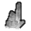

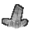

### Glowstone Crystal

An active deposit of glowstone. Grows in wet hot places deep
underground, but rarely active on the surface. Thought to be related in
some way to the living deposits of coldstone in colder climates. They
are prized by the native population for light sources, so there are few
accessible deposits left in the more habitable parts of this rimworld.

**defName:** GlowstoneCrystal

**Beauty:** 20

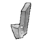
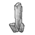
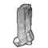

### Salt Crystal

A deposit of salt formed by evaporation of nearbly salt water. Grows
quickly on hot sunny days, but dissolves in the rain or incomming tides.
Only persists in dry climates. Can be harvested to preserve food.

**defName:** ZF\_SaltCrystal

**Beauty:** 2

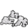

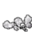

### Sulfur Crystals

A deposit of elemental sulfur formed by volcanic gases. This deposit
seems to be actively growing.

**defName:** SulfurCrystal

**Beauty:** 1

Static minerals
---------------

These are randomly spawned when a map is created and are never respawned
in a given map.

### Calcite Crystal

Crystals of calcium carbonate. A common mineral found underground,
particulary in limestone caves. Interesting, but not otherwise very
useful. Yeilds rubble if mined.

**defName:** CalciteCrystal

**Beauty:** 5

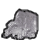

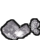

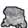

### Quartz Crystal

Crystals of silicon dioxide, the same material glass is made of. A
common mineral found underground. Yeilds glass batch when mined. Once in
a while a gem-quality peice might be found.

**defName:** QuartzCrystal

**Beauty:** 10

### Amethyst Crystal

Crystals of silicon dioxide. Impurities of iron make these crystals a
beautiful purple. A common mineral found underground. Yeilds glass batch
when mined. Sometimes a gem-quality peice might be found.

**defName:** AmethystCrystal

**Beauty:** 15

### Schorl Crystal

The most common and least valuable form of tourmaline, a boron silicate
mineral.

**defName:** SchorlCrystal

**Beauty:** 4

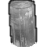

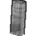

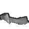

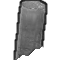

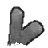

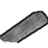

### Rubellite Crystal

A type of tourmaline, a boron silicate mineral with many chemical
variations. This red variety often yeilds high quality gemstones.

**defName:** RubelliteCrystal

**Beauty:** 20

### Indicolite Crystal

A type of tourmaline, a boron silicate mineral with many chemical
variations. This blue-green variety often yeilds high quality gemstones.

**defName:** IndicoliteCrystal

**Beauty:** 20

### Magnetite Crystals

Formations of iron(II,III) oxide, a common iron ore in sedimentary and
igenous rocks.

**defName:** MagnetiteCrystal

**Beauty:** 20

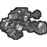

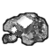

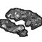

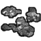

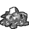

### Lodestone

Formations of iron(II,III) oxide, a common iron ore in sedimentary and
igenous rocks. This particular one seems to be the rare magnetized
variety known as lodestone.

**defName:** LodestoneCrystal

**Beauty:** 15

### Cassiterite Crystals

Formations of tin oxide, a common ore of tin. Occasionally used for gem
stones.

**defName:** CassiteriteCrystal

**Beauty:** NA

### Rubies embedded in rock

Crystals of aluminium oxide embedded in rock. One of the hardest
minerals and often cut into gems. Impurities of chromium color this
patch is a deep red.

**defName:** RubyCrystal

**Beauty:** NA

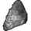
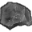
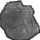

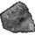
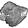
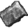
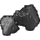

### Sapphires embedded in rock

Crystals of aluminium oxide embedded in rock. One of the hardest
minerals and often cut into gems. Impurities of iron color this patch a
deep blue.

**defName:** SapphireCrystal

**Beauty:** NA

### Emeralds embedded in rock

Crystals of beryl, a type of beryllium aluminium silicate, a rare
mineral often used for gemstones. This variety is green due to trace
impurities of chromium.

**defName:** EmeraldCrystal

**Beauty:** NA

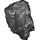
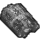
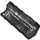
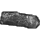
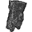
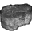

### Diamonds embedded in rock

Crystals of pure carbon. The hardest known substance and a valuable
gemstone.

**defName:** DiamondCrystal

**Beauty:** NA

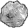
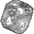
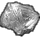
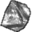
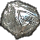

### Uraninite Deposit

Formations of uranium oxide, a major uranium ore. Often assocaited with
silver.

**defName:** UraniniteDeposit

**Beauty:** NA

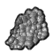

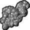

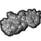

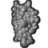

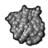

### Malachite Deposit

Beautiful green deposits of copper carbonate hydroxide, sometimes used
for gemstones or a source of copper ore. Often found near copper ore,
azurite, calcite, and limestone rock.

**defName:** MalachiteDeposit

**Beauty:** NA

Giant minerals
--------------

These are large versions of other minerals in this mod and have a chance
to drop a special minified version of the mineral that can be installed
like art. They are very rare and valuable and only occur where their
smaller versions are abundant.

Rocks
-----

The minerals mod enhances the aesthetic and practical aspects of rocks,
including walls and passable obstacles like boulders. Unlike the vanilla
rock walls, these rocks might drop other resources like rubble, sand,
gems, obsidian, and flint, depending on the type. Each type of rock
(limestone, granite, etc) has distinct advantages and disadvantages.
Below are how each type might affect gameplay, in order of hit points.

### Claystone

-   Hit points / time to mine: **lowest**
-   Chunk drop rate: very high
-   Always drops: crushed rock
-   Often drops: soft clay, flint (MineralsCraft mod)
-   Landscape: few rocks and some cover
-   Beauty: high

Claystone is a soft sedimentary rock, so is quite easy to work with and
mine. Unlike other rock type, mining claystone yields soft clay along
with crushed rock.

### Sandstone

-   Hit points / time to mine: very low
-   Chunk drop rate: **highest**
-   Always drops: crushed rock, sand
-   Often drops: flint (MineralsCraft mod)
-   Landscape: few rocks and little cover
-   Beauty: **highest**

Sandstone is a soft sedimentary rock, so is quite easy to work with and
mine. Since sandstone erodes faster than other rocks, sandstone
landscapes tend to be less rocky overall and provide less cover. Unlike
other rock type, mining sandstone yields sand along with crushed rock.

### Slate

-   Hit points / time to mine: low
-   Chunk drop rate: medium
-   Always drops: crushed rock
-   Often drops: slate blocks, flint (MineralsCraft mod)
-   Landscape: not rocky and little cover
-   Beauty: medium

Slate is a fine-grained metamorphic rock formed from compacted volcanic
ash or silt. It forms in regular layers that are rectangular enough to
be used for buildings without stoneworking.

### Limestone

-   Hit points / time to mine: medium
-   Chunk drop rate: high
-   Always drops: crushed rock
-   Often drops: flint (MineralsCraft mod)
-   Landscape: somewhat rocky and some cover
-   Beauty: low

Limestone is a hard sedimentary rock. Its uniformity and medium hardness
makes limestone a good building material.

### Marble

-   Hit points / time to mine: high
-   Chunk drop rate: medium
-   Always drops: crushed rock
-   Often drops: Rough gems
-   Landscape: somewhat rocky and lots of cover
-   Beauty: high

Marble is a metamorphic rock of melted and recrystallized limestone. It
is often used in decorative applications but is also quite hard.

### Basalt (Nature Pretty Sweet mod required)

-   Hit points / time to mine: high
-   Chunk drop rate: low
-   Always drops: crushed rock
-   Often drops: obsidian (MineralsCraft mod)
-   Rarely drops: Rough gems
-   Landscape: very rocky and some cover
-   Beauty: **lowest**

Basalt is the most common igneous rock and is often associated with
recent volcanic activity. Recent lava flows can make basalt landscapes
variable, very rocky, and difficult to build on.

### Granite

-   Hit points / time to mine: **highest**
-   Chunk drop rate: **lowest**
-   Always drops: crushed rock
-   Often drops: Rough gems
-   Landscape: somewhat rocky and lots of cover
-   Beauty: medium

Granite is an igneous rock which cooled slowly deep underground,
allowing for large crystals to form. It is very strong, but difficult to
quarry.

### Rock types

There are three sizes of rocks, which vary in how they restrict movement
and provide cover.

#### Weathered rock walls

These replace the vanilla rock walls that are unroofed when the map
spawns. They have lower hit points than rocks under a mountain.

#### Solid rock walls

These replace the vanilla rock walls that are roofed when the map
spawns.

#### Hewn rock walls

These replace the vanilla rock walls that are on the inside of the
mountain. They are only seen when mining.

#### Boulders

Large rocks that can be climbed over, but cannot be stood on. They
provide very good cover.

#### Rocks

Low numerous rocks that slow movement a little.

Ores
----

All the ores in Hardcore SK have been replaced with rocks with similar
properties in this mod.

Installation
------------

You can download the current development version by clicking the green
"clone or download" button near the top of this page. You can also
download specific "stable" releases
[here](https://github.com/zachary-foster/Minerals/releases), although
they will probably not be updated too often. Once you have downloaded
the mod, uncompress the file and up the folder in the `Mods` folder of
you rimworld installation.

Extension mods
--------------

Check out these optional extension mods that add more mineral-related
content:

-   [MineralsCraft\_SK](https://github.com/zachary-foster/MineralsCraft_SK)
-   [MineralsExtra\_SK](https://github.com/zachary-foster/MineralsExtra_SK)

To xml modders and potential contributers:
------------------------------------------

This mod is set up so that new minerals, both static and dynamic, can be
added and configured using only XML changes. Adding:

    <ThingDef ParentName="StaticMineralBase" Class="Minerals.ThingDef_StaticMineral">
            <defName>MyNewMineral</defName>
        ...
    </ThingDef>

or

    <ThingDef ParentName="DynamicMineralBase" Class="Minerals.ThingDef_DynamicMineral">
            <defName>MyNewMineral</defName>
        ...
    </ThingDef>

to an XML file in `Defs/ThingDefs_Minerals` will cause a new mineral to
be added to the game.

To add a mineral:

-   Copy the `ThingDef` for an existing mineral that is most similar to
    the one you want to make. Modify the XML how you want and add it to
    an XML file in `Defs/ThingDefs_Minerals`. Make sure to change the
    `defName`.
-   Create textures for the new mineral and add to them to
    `Textures/Things/Mineral` in the same format as the others there.
-   If you want to have you changes added to this mod for others to use,
    consider [forking](https://help.github.com/articles/fork-a-repo/)
    this repository and submitting a [pull
    request](https://help.github.com/articles/about-pull-requests/). I
    welcome contributions!

Ideas for future work
---------------------

### Events

#### Minerals nearby

A visitor or trader gives you the map position to a tile with a high
concentration of some mineral. This would highlight an area with a
naturally high level of that mineral and the conditions it occurs in.
When visiting the spot on the map, the natural abundance of that mineral
is doubled.

#### Valuable Minerals nearby

Same as "Minerals nearby", but only happens with valuable minerals.
There is a chance that a raid will occur while you are there

#### Enemy mining camp

Same as "Valuable Minerals nearby", except there is a temporary base
already there. There would be tents and pack animals and some minerals
already mined. A raid of the same faction might occur while there.

#### Ancient treasure hoard

A trader of visitor offers to let you know about a hidden treasure hoard
in the mountains for a price. The treasure is in a room of a sealed off
base. There might be insects or mechs in the base and raids might occur
when on the map. In one of the rooms is lots of gems, silver, gold,
jade, and jeweled weapons/apparel.

#### Hidden minerals found

One of you colonists notice some minerals on your map. Only applies to
minerals embedded in rock that might be overlooked, like gemstones and
flint.

#### Strange green crystals

"A cluster of strange green crystals have been left behind by a meteor.
They are glowing and seem to be growing."

A type of proto-mechinoid terraforming event that evolves over time.

1.  A single cluster of crystals are left by a meteor.
2.  These grow slowly in light, but grow faster when parasitizing
    anything biological nearby. They begin to reproduce once big enough.
3.  Once full sized, they spawn other types, some natural metal ores and
    some more exotic. These turn the ground they grow on to wasteland
    once full size.
4.  Once full size crystals are spawned a fixed distance from the
    meteor, a type is spawned that is impassible and creates a wall and
    encloses an area, while other crystals continue to spread outwards.
5.  Once metal ores are full size, a new type is spawned that explode
    into "micromech swarms". Another type produces defensive "seekers",
    which patrol the area and fly into any intruders with a small
    explosion.
6.  micromech swarms begin to harvest the ores and build full size mechs
    which attack the colony once mature.

Image sources used
------------------

I based some of the textures off of images with licenses for
non-commercial reuse. Here are the list of images used:

-   Rob Lavinsky, iRocks.com – CC-BY-SA-3.0
    [link](https://commons.wikimedia.org/wiki/File:Elbaite-Quartz-Albite-164061.jpg)
-   Rob Lavinsky, iRocks.com – CC-BY-SA-3.0
    [link](https://commons.wikimedia.org/wiki/File:Elbaite-Lepidolite-Quartz-gem7-x1c.jpg)
-   Didier Descouens – GNU 1.2
    [link](https://commons.wikimedia.org/wiki/File:Selpologne.jpg)
-   Piotr Sosnowski – GNU 1.2
    [link](https://commons.wikimedia.org/wiki/File:Halite-crystals2.jpg)
-   Tjflex2 of flickr - CC-BY-SA-3.0
    [link](https://www.flickr.com/photos/tjflex/358359211)
-   <https://www.maxpixel.net/Crystal-Jewelry-Clear-Quartz-Value-2187139>
-   <https://www.flickr.com/photos/31856336@N03/3108675089>
-   <https://commons.wikimedia.org/wiki/File:Sapphire_Gem.jpg>
-   <https://commons.wikimedia.org/wiki/File:Cornflower_blue_Yogo_sapphire.jpg>
-   <https://commons.wikimedia.org/wiki/File:Black_obsidian.JPG>
-   <https://commons.wikimedia.org/wiki/File:Different_rocks_at_Panum_Crater.jpg>
-   <https://pixabay.com/en/obsidian-stone-volcanic-rocks-glass-505333/>
-   <https://www.flickr.com/photos/jsjgeology/36696371493>
-   <https://commons.wikimedia.org/wiki/File:Egyptian_flint_knives,_predynastic._Wellcome_M0016545EB.jpg>
-   <https://commons.wikimedia.org/wiki/File:Native_tribes_of_South-East_Australia_Fig_14_-_Stone_axe.jpg>
-   <https://github.com/Rikiki123456789/Rimworld/tree/ab7930661284c19e5dc4b9b01f2499bd88116378/CaveBiome/CaveBiome>
-   <https://commons.wikimedia.org/wiki/File:Pyrite-Tetrahedrite-Quartz-184642.jpg>
-   <https://commons.wikimedia.org/wiki/File:Pyrite-258273.jpg>
-   <https://commons.wikimedia.org/wiki/File:2780M-pyrite1.jpg>
-   <https://it.wikipedia.org/wiki/File:Una_mazza_Maquahuitl.jpg>
-   <https://commons.wikimedia.org/wiki/File:Elbaite-Lepidolite-Quartz-gem7-x1a.jpg>
-   <https://www.flickr.com/photos/jsjgeology/31997092221>
-   <https://commons.wikimedia.org/wiki/File:Schorl-181669.jpg>
-   <https://commons.wikimedia.org/wiki/File:Quartz-Schorl-k-142a.jpg>
-   <https://www.flickr.com/photos/orbitaljoe/5030069066>
-   <https://commons.wikimedia.org/wiki/File:Tourmaline-164039.jpg>
-   <https://commons.wikimedia.org/wiki/File:Tourmaline-34580.jpg>
-   <https://commons.wikimedia.org/wiki/File:Elbaite-Lepidolite-Quartz-gem7-x1a.jpg>
-   <https://commons.wikimedia.org/wiki/File:Sulfur-es67a.jpg>
-   <https://commons.wikimedia.org/wiki/File:Sulfur-20edd1ea.jpg>
-   <https://fr.m.wikipedia.org/wiki/Fichier:Sulfur_(16_S).jpg>
-   <https://www.flickr.com/photos/jsjgeology/17541066095>
-   <https://commons.wikimedia.org/wiki/File:Corundum-275089.jpg>
-   <https://commons.wikimedia.org/wiki/File:Corundum-215245.jpg>
-   <https://commons.wikimedia.org/wiki/File:Corundum-tmix07-151a.jpg>
-   <https://commons.wikimedia.org/wiki/File:Corundum-190228.jpg>
-   <https://commons.wikimedia.org/wiki/File:Corundum-119783.jpg>
-   <https://commons.wikimedia.org/wiki/File:Beryl-Quartz-Emerald-Zambia-85mm_0872.jpg>
-   <https://commons.wikimedia.org/wiki/File:Gachala_Emerald_3526711557_849c4c7367.jpg>
-   <https://commons.wikimedia.org/wiki/File:Diamant_sur_kimberlite_(R%C3%A9publique_d%27Afrique_du_Sud).JPG>
-   <https://commons.wikimedia.org/wiki/File:Diamond-21988.jpg>
-   <https://commons.wikimedia.org/wiki/File:Diamond-dimd5b.jpg>  
-   <https://www.flickr.com/photos/jsjgeology/17440851983>
-   <https://commons.wikimedia.org/wiki/File:Diamond-dimd5a.jpg>
-   <https://vi.wikipedia.org/wiki/T%E1%BA%ADp_tin:Pitchblende_schlema-alberoda.JPG>
-   <https://www.flickr.com/photos/jahansell/5379933134>
-   <http://www.geograph.ie/photo/4763916> © Copyright Eric Jones and
    licensed for reuse under this Creative Commons Licence.
-   <https://www.flickr.com/photos/jsjgeology/29921127566>
    CopyrightJames St. John
-   <https://www.flickr.com/photos/brewbooks/757551002/in/photostream/>
    Copyright brewbooks
-   <https://www.flickr.com/photos/98425334@N00/130957324/>
-   <https://commons.wikimedia.org/wiki/File:River_side_pebbles_and_rocks.jpg>
    Shashank ghosh
-   <https://www.flickr.com/photos/jsjgeology/32770894262> James St.
    John
-   <https://commons.wikimedia.org/wiki/File:Dioptase-285219.jpg> Rob
    Lavinsky
-   <https://commons.wikimedia.org/wiki/File:Native_copper_in_calcite_crystal_(late_Mesoproterozoic_mineralization_age,_1.05-1.06_Ga;_Quincy_Mine,_Hancock,_Keweenaw_Peninsula,_Upper_Peninsula_of_Michigan,_USA)_5_(17300587602).jpg>
    James St. John
-   <https://commons.wikimedia.org/wiki/File:Calcite-20188.jpg>
    Robert M. Lavinsky
-   <https://www.flickr.com/photos/jsjgeology/43729746151> James St.
    John
-   <https://commons.wikimedia.org/wiki/File:Calcite-Chlorite-Group-67816.jpg>
    Rob Lavinsky
-   <https://torange.biz/smoky-quartz-44694>
-   <https://www.flickr.com/photos/jsjgeology/42778129494>
-   <https://commons.wikimedia.org/wiki/File:Hoodoos_at_Bryce_Canyon.jpg>
