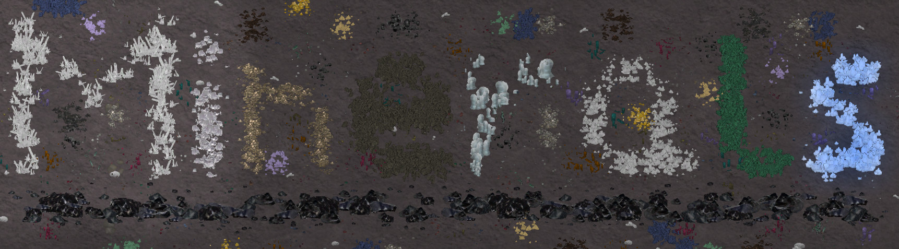

```{r setup, include=FALSE}
library(mineralsReadmePrinter)
knitr::opts_chunk$set(echo = FALSE)
```


## MineralsFrozen_SK: A rimworld mod for the [Hardcore SK project](https://github.com/skyarkhangel/Hardcore-SK)




This mod is an extension of [Minerals_SK](https://github.com/zachary-foster/Minerals_SK) and must come after it in the load order.


## Dynamic minerals

These spawn, grow, and shrink depending on conditions.

```{r}
print_minerals("Defs/ThingsDefs_Minerals/DynamicMinerals.xml")
```


## Resources


## Installation

You can download the current development version by clicking the green "clone or download" button near the top of this page. You can also download specific "stable" releases [here](https://github.com/zachary-foster/MineralsExtra/releases), although they will probably not be updated too often. Once you have downloaded the mod, uncompress the file and up the folder in the `Mods` folder of you rimworld installation.


## To xml modders and potential contributers:

This mod is set up so that new minerals, both static and dynamic, can be added and configured using only XML changes.
Adding:

```
<ThingDef ParentName="StaticMineralBase">
		<defName>MyNewMineral</defName>
    ...
</ThingDef>
```

or

```
<ThingDef ParentName="DynamicMineralBase">
		<defName>MyNewMineral</defName>
    ...
</ThingDef>
```

to an XML file in `Defs/ThingDefs_Minerals` will cause a new mineral to be added to the game.

To add a mineral: 

* Copy the `ThingDef` for an existing mineral that is most similar to the one you want to make. Modify the XML how you want and add it to an XML file in `Defs/ThingDefs_Minerals`. Make sure to change the `defName`.
* Create textures for the new mineral and add to them to `Textures/Things/Mineral` in the same format as the others there.
* If you want to have you changes added to this mod for others to use, consider [forking](https://help.github.com/articles/fork-a-repo/) this repository and submitting a [pull request](https://help.github.com/articles/about-pull-requests/). I welcome contributions!


## Ideas for future work

### Resources

#### Blue ice


### Mineral types

#### Giant Hailstone

Dropped by "Giant Hail" event.
Can be mined for ice blocks.


### Events

#### Blue snow

"A strange blue snow is falling over this region."

Smooth snow drifts and coldstone crystals spawn much faster for a while and the temperature drops 5C.
There is a blue visual effect.
Only occurs when temperature is below 0C.
Lasts 0.5-3 days.

#### Giant Hail

"An unusually violent storm is producing giant hail in this region. Anything outside could be damaged."

A visual effect and sound effect.
Locations take blunt damage randomly, 
Only occurs during thunderstorms, or snow, when temp is below 5C. 
Lasts 0.1-0.5 days. 

