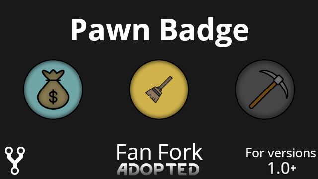

# PawnBadge for RimWorld

A RimWorld mod that allows adding up to 2 informative badges to the colonist bar.



Download:
[https://github.com/SaucyPigeon/RR_PawnBadge/releases/latest](https://github.com/SaucyPigeon/RR_PawnBadge/releases/latest)

### Custom Icons

To make a mod to add more badge icons, follow these steps:

In your mod's "About/About.xml" file, add the following XML:
```xml
<modDependencies>
	  <li>
		    <packageId>SaucyPigeon.PawnBadge</packageId>
		    <displayName>Pawn Badge Fan Fork</displayName>
		    <downloadUrl>https://github.com/SaucyPigeon/RR_PawnBadge/releases/latest</downloadUrl>
		    <steamWorkshopUrl>steam://url/CommunityFilePage/2112663412</steamWorkshopUrl>
	  </li>
</modDependencies>

<loadAfter>
	  <li>SaucyPigeon.PawnBadge</li>
</loadAfter>
```

And in your mod "Defs" directory create an XML file like this:

```xml
<?xml version="1.0" encoding="utf-8" ?>
<Defs>

	<RR_PawnBadge.BadgeDef>
		<defName>Crown</defName>
		<label>Crown</label>
		<description>A golden crown</description>
		<icon>PawnBadge/Crown</icon>
	</RR_PawnBadge.BadgeDef>
	
</Defs>
```

Put a "Crown.png" file in the "Textures/PawnBadge" directory, and it's done!

See [this](https://github.com/RangelReale/RR_PawnBadge_BadgeSample) repository for a sample of a mod adding a new icon.

### Credits

Rangel Reale (original author)

Saucy_Pigeon (updated code)

LeninsCat (fixed manifest error, updated textures)
